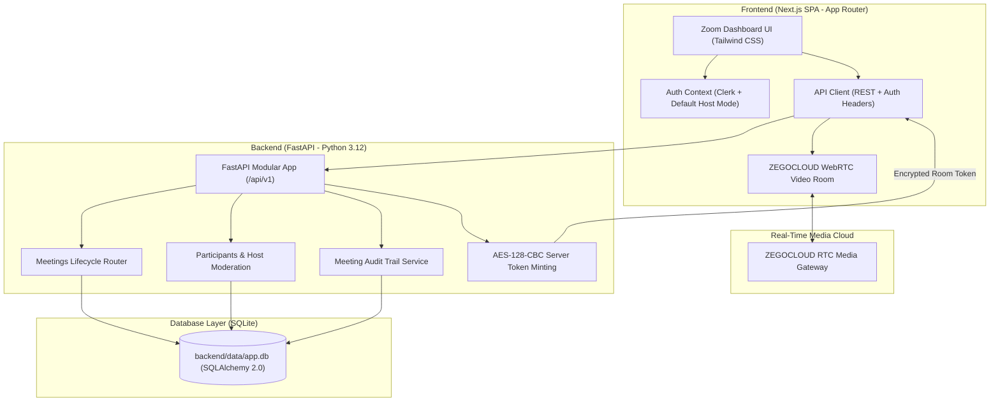
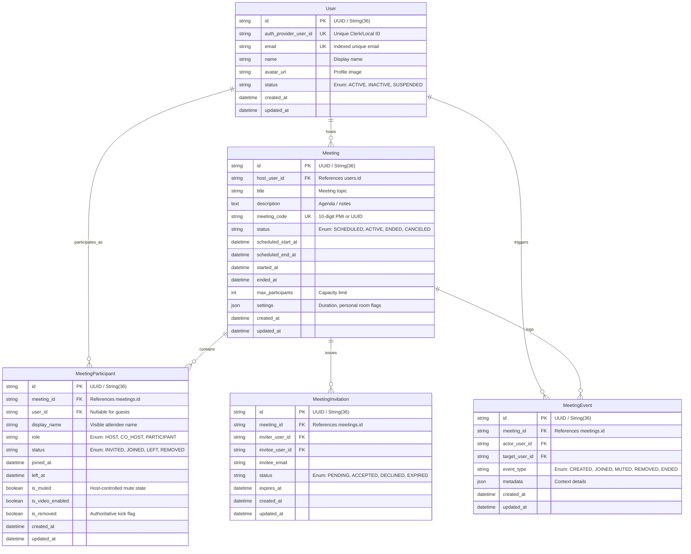

# Video Conferencing Platform (Zoom Clone) - SDE Fullstack Assignment

[](https://zoomassignment.vercel.app)
[-blue)](https://nextjs.org/)
[-009688)](https://fastapi.tiangolo.com/)
[](https://www.sqlite.org/)
[](https://www.zegocloud.com/)

A modern, full-stack video conferencing web application designed and built to replicate the user experience, design system, and core meeting workflows of the **Zoom Web App**.

- **Deployed Application Link**: [https://zoomassignment.vercel.app](https://zoomassignment.vercel.app)
- **GitHub Repository**: [https://github.com/Sidd2004Shukla/zoomAssignment](https://github.com/Sidd2004Shukla/zoomAssignment)

---

## Evaluation Requirements & Feature Compliance

| Assignment Requirement | Feature Implementation | Status |
| :--- | :--- | :---: |
| **Landing Dashboard** | Clean Zoom UI, navigation bar with profile & settings placeholders, action buttons (New Meeting, Schedule, Join), Upcoming and Previous meetings sections. | **Complete** |
| **Instant Meeting Creation** | One-click instant meeting creation, auto-generates 10-digit Meeting ID and shareable link, redirects to active room. | **Complete** |
| **Join Meeting** | Join via Meeting ID or invite URL, enter/confirm display name in pre-join lobby, validates meeting existence with error feedback. | **Complete** |
| **Schedule Meetings** | Modal with Topic/Title, Description, Date & Time picker, and Duration dropdown. Stores in SQLite and populates Upcoming Meetings. | **Complete** |
| **No Login Required** | Pre-configured Default Host User (`Alex Morgan`) allows immediate evaluation of all features without requiring sign-up. | **Complete** |
| **Sample Data (Seeding)** | Auto-seeds on startup and via `python -m app.core.seed` with upcoming calls, previous calls, and audit events. | **Complete** |
| **Database Design** | 5 relational tables (`users`, `meetings`, `meeting_participants`, `meeting_invitations`, `meeting_events`) with strict foreign keys and indexes. | **Complete** |
| **Bonus: Responsive Design** | Fully responsive layout across mobile, tablet, and desktop with dedicated slide-over mobile navigation. | **Complete** |
| **Bonus: User Authentication** | Production-ready Clerk Login/Signup with dedicated Zoom-styled auth pages and quick-skip demo mode. | **Complete** |
| **Bonus: Host Controls** | Authoritative moderator panel with Mute All, per-participant mute/unmute, and remove participant (kick) actions. | **Complete** |

---

## Architecture Overview



---

## Database Design & Schema

The relational schema is implemented with SQLAlchemy 2.0 and SQLite, featuring foreign key constraints, cascading rules, and composite indexes.



---

## Assumptions & Design Decisions

1. **No Login Required & Seamless Evaluation**:
   - The assignment notes: *"Assume a default user is logged in. Focus on the functionality rather than authentication."*
   - To provide the best evaluation experience, visiting the application immediately logs you in as **`Alex Morgan` (Default Host)**.
   - Evaluators can immediately test **New Meeting**, **Join Meeting**, **Schedule Meeting**, and **Personal Room** without entering credentials.
   - For evaluators who want to test the **User Authentication (Bonus)**, Clerk sign-in and sign-up are fully configured with a one-click *"Skip Login &rarr;"* demo button.
2. **Server-Side Token Security**:
   - WebRTC media tokens are minted exclusively by the FastAPI backend using AES-128-CBC encryption and an dynamic expiration timestamp. Client browsers never receive the ZegoCloud server secret.
3. **Deterministic Personal Meeting ID (PMI)**:
   - Personal rooms generate a deterministic 10-digit Zoom-style ID (e.g. `839-204-1582`) derived from the user's identity, allowing permanent, repeatable room links.
4. **Vercel Services Architecture**:
   - Deployable as a unified monorepo on Vercel Services where frontend routes (`/(.*)`) and backend API endpoints (`/api/(.*)`) run seamlessly with private service bindings.

---

## Getting Started & Local Setup

### 1. Prerequisites
- **Node.js**: v18+ (tested on Node v20/v22)
- **Python**: v3.10+ (tested on Python 3.12)
- **Git**

### 2. Backend Setup
```bash
# Navigate to backend directory
cd backend

# Install dependencies
pip install -r requirements.txt

# Run database migrations
alembic upgrade head

# Seed sample data (optional - auto-seeds on first run)
python -m app.core.seed

# Start FastAPI development server
python -m uvicorn app.main:app --host 127.0.0.1 --port 8000 --reload
```
The FastAPI backend will be running at `http://127.0.0.1:8000`.
Interactive Swagger API docs: `http://127.0.0.1:8000/docs`.

### 3. Frontend Setup
```bash
# Navigate to frontend directory
cd frontend

# Install dependencies
npm install

# Start Next.js development server
npm run dev
```
The application will be running at `http://localhost:3000`.

### 4. Running Verification & Automated Tests
To run the automated backend test suite (verifying all 13 core endpoints and moderation workflows):
```bash
cd backend
python tests/test_api_suite.py
```
Expected output:
```
=== STARTING AUTOMATED BACKEND VERIFICATION ===
1. GET /health -> 200 OK
2. POST /users -> 201 Created
3. POST /meetings -> 201 Created
4. GET /meetings/{id} and {code} -> 200 OK
5. POST /meetings/{id}/join -> 200 OK
6. GET /meetings/{id}/participants -> 200 OK
7. POST /meetings/{id}/participants/{id}/mute -> 200 OK
8. POST /meetings/{id}/participants/mute-all -> 200 OK
9. POST /meetings/{id}/zego-token -> 200 OK
10. PATCH /meetings/{id} -> 200 OK
11. POST /meetings/{id}/leave -> 200 OK
12. DELETE /meetings/{id}/participants/{id} -> 200 OK
13. GET /meetings/{id}/events -> 200 OK

=== ALL 13 BACKEND ENDPOINTS & STAGES VERIFIED PERFECTLY! ===
```

To run linting and typecheck on the frontend:
```bash
cd frontend
npm run lint         # 0 warnings, 0 errors
npx tsc --noEmit     # 0 errors
npm run build        # Production build successful
```

---

## API Endpoints Reference (`/api/v1`)

| Method | Endpoint | Description |
| :--- | :--- | :--- |
| `GET` | `/health` | Service health status |
| `POST` | `/users` | Create / sync user profile |
| `GET` | `/users/{id}` | Fetch user by ID |
| `POST` | `/meetings` | Create meeting (instant, scheduled, or personal) |
| `GET` | `/meetings` | List all meetings sorted chronologically |
| `GET` | `/meetings/{id}` | Fetch meeting by ID or 10-digit meeting code |
| `PATCH` | `/meetings/{id}` | Update meeting status, title, or schedule |
| `DELETE` | `/meetings/{id}` | Delete / cancel meeting |
| `POST` | `/meetings/{id}/join` | Register attendee participation (`JOINED`) |
| `POST` | `/meetings/{id}/leave` | Mark participant as `LEFT` |
| `POST` | `/meetings/{id}/zego-token` | Generate authenticated WebRTC room token |
| `GET` | `/meetings/{id}/events` | Fetch complete audit event trail |
| `GET` | `/meetings/{id}/participants` | List active participants in meeting |
| `POST` | `/meetings/{id}/participants/{id}/mute` | Mute/unmute attendee (Host only) |
| `POST` | `/meetings/{id}/participants/mute-all` | Mute all attendees (Host only) |
| `DELETE` | `/meetings/{id}/participants/{id}` | Remove / kick participant (Host only) |

---

## Project Structure

```
zoom_Assignment/
├── backend/
│   ├── app/
│   │   ├── auth/              # Auth dependencies & token parsing
│   │   ├── common/            # Database enums (MeetingStatus, ParticipantRole, etc.)
│   │   ├── core/              # Config, database engine, JWT security, data seeder
│   │   ├── events/            # Meeting audit event logger
│   │   ├── integrations/      # ZEGOCLOUD AES-128-CBC kit token generator
│   │   ├── meetings/          # Meeting CRUD, lifecycle, join/leave, tokens
│   │   ├── participants/      # Participant management & host moderation
│   │   ├── permissions/       # Host/co-host authorization guards
│   │   ├── users/             # User profiles & user sync
│   │   ├── api.py             # Router aggregator & lifespan DB init
│   │   ├── main.py            # FastAPI entry point & CORS configuration
│   │   ├── models.py          # SQLAlchemy 2.0 ORM models (5 tables)
│   │   └── schemas.py         # Pydantic v2 request & response schemas
│   ├── data/
│   │   └── app.db             # Local SQLite database
│   ├── migrations/            # Alembic migrations
│   ├── tests/
│   │   └── test_api_suite.py  # 13-stage automated verification suite
│   ├── requirements.txt
│   └── alembic.ini
│
└── frontend/
    ├── app/
    │   ├── (auth)/            # Clerk sign-in and sign-up with demo skip
    │   ├── (root)/
    │   │   ├── (home)/        # Dashboard, Upcoming, Previous, Personal Room
    │   │   └── meeting/[id]/  # Dynamic live meeting room & pre-join lobby
    │   ├── layout.tsx         # ClerkProvider, Root layout & fonts
    │   └── globals.css        # Tailwind styles & Zoom theme tokens
    ├── components/
    │   ├── meeting-room.tsx   # Live WebRTC room & Host Roster controls
    │   ├── meeting-type-list.tsx # Action modals (Schedule, Join, Instant)
    │   ├── meeting-card.tsx   # Clean Zoom meeting cards
    │   ├── call-list.tsx      # Upcoming / Previous calls list
    │   ├── navbar.tsx         # Navbar with profile, settings & help dialogs
    │   ├── sidebar.tsx        # Navigation sidebar
    │   ├── auth-guard.tsx     # Instant default user access guard
    │   └── ui/                # Radix UI primitives
    ├── hooks/
    │   ├── use-current-user.ts # Unified Clerk / Default User provider
    │   ├── use-get-call-by-id.ts
    │   └── use-get-calls.ts
    ├── lib/api/               # Typed API client layer
    └── package.json
```
