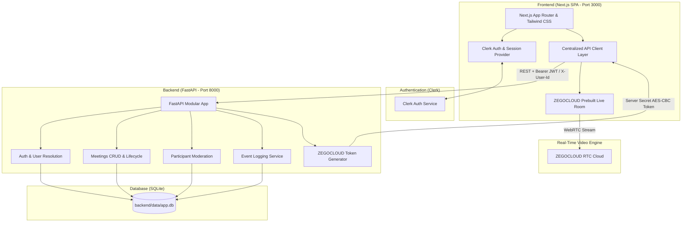

# Zoom Clone - Real-Time Video Conferencing Application

A full-stack Zoom-clone web application featuring an interactive Next.js SPA frontend, a high-performance Python FastAPI backend, SQLite persistence via SQLAlchemy & Alembic, and real-time audio/video powered by ZEGOCLOUD.

---

## Architecture Overview



---

## Technology Stack

- **Frontend**:
  - Next.js 15 (App Router, Single Page Application)
  - React 19 & TypeScript
  - Tailwind CSS & Radix UI Primitives
  - Lucide React Icons
  - `@zegocloud/zego-uikit-prebuilt` (Real-Time Audio/Video)
  - `@clerk/nextjs` (Authentication)
- **Backend**:
  - Python 3.12 & FastAPI
  - Uvicorn (ASGI Server)
  - SQLAlchemy 2.0 (ORM)
  - Alembic (Database Migrations)
  - Cryptography & PyJWT (Token Security)
- **Database**:
  - SQLite (stored locally at `backend/data/app.db`)
- **Video & Audio**:
  - ZEGOCLOUD Video Conference Engine with AES-CBC PKCS7 server-generated kit tokens

---

## Key Features

1. **Authentication & Identity**:
   - Secure login and registration via Clerk.
   - Protected routes via Next.js middleware.
   - Automatic backend identity resolution and user auto-provisioning.
2. **Meeting Management**:
   - **Instant Meetings**: Start a room immediately with a single click.
   - **Scheduled Meetings**: Schedule future calls with interactive date/time picker.
   - **Personal Meeting Room**: Dedicated static room link per user.
   - **Join by ID / Code**: Paste a meeting link or UUID code to join.
3. **In-Meeting Experience**:
   - Real-time video grid and active speaker views.
   - Dynamic layout switching (`Auto`, `Grid`, `Sidebar`).
   - Microphone, camera, and device settings controls.
   - Screen sharing and in-room chat.
4. **Host Moderation Controls**:
   - Centralized permission guards ensuring only host/co-host can moderate.
   - **Mute All**: One-click mute for all attendees.
   - **Per-Participant Mute/Unmute**: Moderation menu per participant.
   - **Remove Participant**: Authoritatively kick disruptive attendees.
   - **End Meeting for Everyone**: Host can end the session and clean up the room.
5. **Participant Roster & Live Status**:
   - Slide-over live roster drawer showing connected participants, roles (`HOST`, `PARTICIPANT`), joined timestamps, and mute status.
6. **Audit Trail & Event Logging**:
   - Complete event history tracked in SQLite: `MEETING_CREATED`, `PARTICIPANT_JOINED`, `PARTICIPANT_LEFT`, `PARTICIPANT_MUTED`, `ALL_PARTICIPANTS_MUTED`, `PARTICIPANT_REMOVED`, `MEETING_ENDED`.
7. **Dashboard & Meeting History**:
   - Live dashboard clock and next upcoming meeting preview.
   - Upcoming and Previous meeting tabs sorted chronologically.

---

## Directory Structure

```
zoom_Assignment/
├── backend/
│   ├── app/
│   │   ├── auth/              # Auth dependencies & /auth/me router
│   │   ├── common/            # Enums (MeetingStatus, ParticipantRole, etc.)
│   │   ├── core/              # Config, database setup, JWT security
│   │   ├── events/            # Meeting audit event logger
│   │   ├── integrations/      # ZEGOCLOUD AES token generation service
│   │   ├── meetings/          # Meeting CRUD, lifecycle, join/leave, tokens
│   │   ├── participants/      # Participant management & moderation controls
│   │   ├── permissions/       # Host/co-host authorization guards
│   │   ├── users/             # User profiles & user sync router
│   │   ├── api.py             # Router aggregator
│   │   ├── main.py            # FastAPI entry point & CORS configuration
│   │   ├── models.py          # SQLAlchemy models (5 tables)
│   │   └── schemas.py         # Pydantic request & response schemas
│   ├── data/
│   │   └── app.db             # Local SQLite database
│   ├── migrations/            # Alembic migrations
│   ├── tests/
│   │   └── test_api_suite.py  # Automated integration verification suite
│   ├── requirements.txt
│   └── alembic.ini
│
└── frontend/
    ├── app/
    │   ├── (auth)/            # Clerk sign-in and sign-up pages
    │   ├── (root)/
    │   │   ├── (home)/        # Dashboard, Upcoming, Previous, Recordings, Personal Room
    │   │   └── meeting/[id]/  # Live meeting room dynamic route
    │   ├── layout.tsx         # ClerkProvider & Root layout
    │   └── globals.css        # Global Tailwind styles
    ├── components/
    │   ├── meeting-room.tsx   # Live ZEGOCLOUD container & Host Roster
    │   ├── meeting-type-list.tsx # Action cards (New Meeting, Schedule, Join)
    │   ├── call-list.tsx      # Upcoming / Previous calls list
    │   ├── navbar.tsx         # Navbar with Clerk UserButton
    │   ├── sidebar.tsx        # Navigation sidebar
    │   └── ui/                # Radix UI components
    ├── hooks/
    │   ├── use-get-call-by-id.ts
    │   └── use-get-calls.ts
    ├── lib/api/               # Typed API client layer (client, meetings, participants, zego)
    ├── middleware.ts          # Clerk route protection middleware
    └── package.json
```

---

## Backend API Reference (`/api/v1`)

| Method | Endpoint | Description |
|---|---|---|
| `GET` | `/health` | API health check |
| `GET` | `/auth/me` | Resolve current authenticated user profile |
| `POST` | `/users` | Create or sync user record |
| `GET` | `/users/me` | Fetch active user profile |
| `PATCH` | `/users/me` | Update active user profile |
| `GET` | `/users/{id}` | Fetch user by ID |
| `POST` | `/meetings` | Create meeting (instant, scheduled, or personal) |
| `GET` | `/meetings` | List all meetings sorted by creation date |
| `GET` | `/meetings/{id}` | Get meeting by ID or meeting code |
| `PATCH` | `/meetings/{id}` | Update meeting status or scheduled times |
| `DELETE` | `/meetings/{id}` | Delete / cancel meeting |
| `POST` | `/meetings/{id}/join` | Register attendee participation (`JOINED`) |
| `POST` | `/meetings/{id}/leave` | Mark participant as `LEFT` |
| `POST` | `/meetings/{id}/zego-token` | Generate authenticated ZEGOCLOUD kit token |
| `GET` | `/meetings/{id}/events` | Fetch complete meeting audit history |
| `GET` | `/meetings/{id}/participants` | List active meeting participants |
| `POST` | `/meetings/{id}/participants` | Add / invite participant |
| `DELETE` | `/meetings/{id}/participants/{id}` | Remove attendee (Host only) |
| `POST` | `/meetings/{id}/participants/{id}/mute` | Mute/unmute attendee (Host only) |
| `POST` | `/meetings/{id}/participants/mute-all` | Mute all attendees (Host only) |

---

## Getting Started

### 1. Prerequisites
- Node.js v18+ (tested on Node v22)
- Python 3.10+ (tested on Python 3.12)

### 2. Backend Setup
```bash
cd backend

# Install dependencies
pip install -r requirements.txt

# Run database migrations
alembic upgrade head

# Start FastAPI server
python -m uvicorn app.main:app --host 127.0.0.1 --port 8000 --reload
```
The backend API is accessible at `http://127.0.0.1:8000`. Interactive OpenAPI documentation is available at `http://127.0.0.1:8000/docs`.

### 3. Frontend Setup
```bash
cd frontend

# Install dependencies
npm install

# Start Next.js dev server
npm run dev
```
The application is accessible at `http://localhost:3000`.

### 4. Running Automated Tests
To run the full backend integration test suite:
```bash
cd backend
python tests/test_api_suite.py
```
Expected output:
```
=== STARTING AUTOMATED BACKEND VERIFICATION ===
1. GET /health -> 200 OK
2. POST /users -> 201 Created
3. POST /meetings -> 201 Created
4. GET /meetings/{id} and {code} -> 200 OK
5. POST /meetings/{id}/join -> 200 OK
6. GET /meetings/{id}/participants -> 200 OK
7. POST /meetings/{id}/participants/{id}/mute -> 200 OK
8. POST /meetings/{id}/participants/mute-all -> 200 OK
9. POST /meetings/{id}/zego-token -> 200 OK
10. PATCH /meetings/{id} -> 200 OK
11. POST /meetings/{id}/leave -> 200 OK
12. DELETE /meetings/{id}/participants/{id} -> 200 OK
13. GET /meetings/{id}/events -> 200 OK

=== ALL 13 BACKEND ENDPOINTS & STAGES VERIFIED PERFECTLY! ===
```
